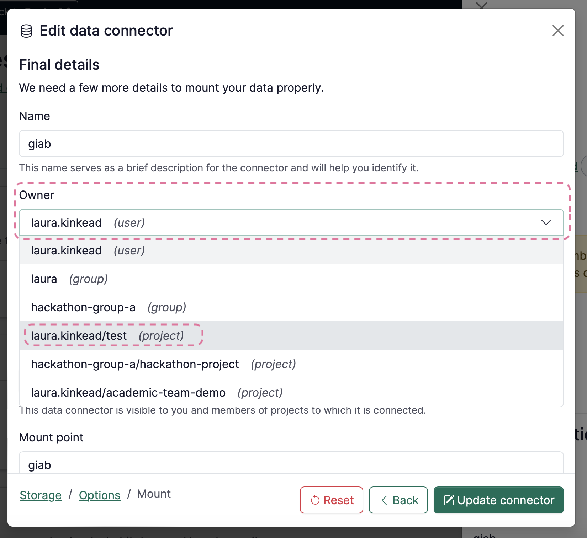
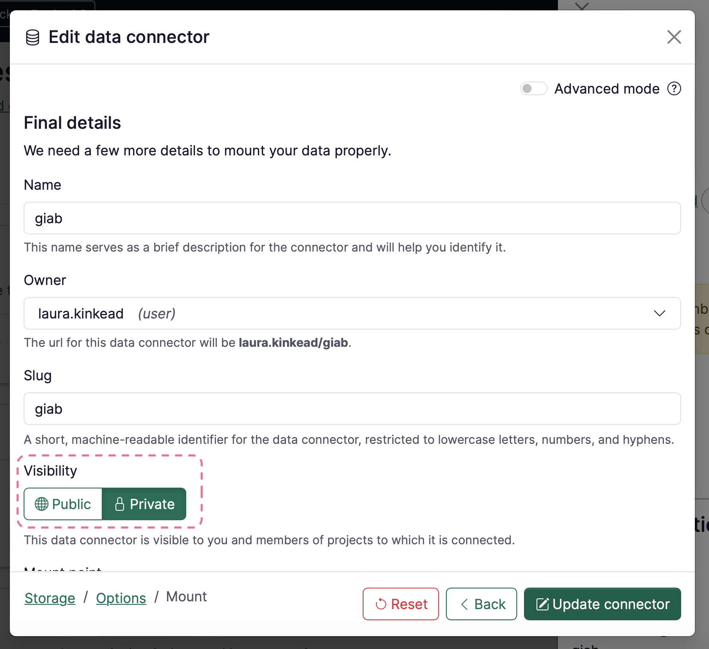

# About visibility warnings

You may sometimes see a note that there are **hidden data connectors** that you can’t see,
especially in projects were created before version 0.67.0. And conversely, you may see **visibility
warnings** on data connectors that *other* project members can’t see. This how-to guide will walk
you through what these warnings mean and how to resolve them.

 

A notification about hidden data connectors

 

A data connector with a visibility warning

## What hidden data connectors mean

If you see a note that there are hidden data connectors on a project, that means that there are data connectors linked to the project that you do not have access rights to view.

Hidden data connectors may be intentional- someone in the project has linked a personal data connector that you do not need access to. Or, it might mean that someone has accidentally created a data connector in a way that does not grant everyone in the project access.

In order to determine if a hidden data connector represents an issue, speak with the other members of the project. For each data connector that is hidden for you, there is one marked with a visibility warning for someone else!

## What visibility warnings mean

A data connector visibility warning means that there may be members of the project who cannot see the data connector. This happens when data connector is private and is owned by another user.

This may be intentional! For example, if you create a personal data connector for your personal Switchdrive folder and link it to a project, other people in the project don’t see that data connector, and that’s intentional!

But if you see a visibility warning on a data connector that everyone in the project *should* be able to see and use, you’ll want to fix that. Next, we’ll walk through how to do just that.

## How to resolve a visibility warning

### Option 1: Move the data connector to be owned by the project

1. Click on the data connector with the visibility warning to open its side sheet
2. In the side sheet, click on **Edit** in the top right
    
    
 
    
    

    
3. Depending on your data connector, either click **Next**, or click **Test Connection** and then **Continue** to get to the next page of the data connector information
    
    
    
4. Change the **Owner** to the current project.
    
    
    

Now the data connector is owned by the project, so everyone in the project is guaranteed to be able to see the data connector.

### Option 2: Make the data connector public

:::warning

Do not make a data connector public if it supports write access and does not require credentials!

:::

Another option is to make the data connector public. This will guarantee that everyone can see the data connector.

1. Click on the data connector with the Visibility warning to open its side sheet
2. In the side sheet, click on **Edit** in the top right
   
    
 
    
    

    
3. Depending on your data connector, either click **Next**, or click **Test Connection** and then **Continue** to get to the next page of the data connector information
    
    
    
4. Change the visibility to **Public**
    
    
