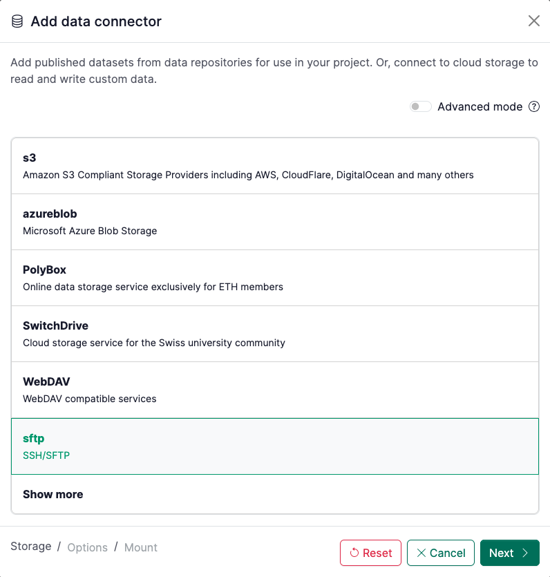

# How to connect to an SFTP server (e.g. EPFL NAS)

## 1. Reuse an existing SFTP data connector or create a new one

If you already have an SFTP data connector available in your personal account or in a group that you are a member of, go ahead and simply [link that data connector](/docs/users/data/guides/link-data-connector-to-project) to your project.

If you need to create a new one, click on the `+` to add a new data connector and select `sftp`

<p class="image-container-l">

</p>

## 2. Enter connection details

Note that for the EPFL NAS, the server address is `fts.epfl.ch`.

If you are reusing a data connector, click on it to open the side panel and select the “Credentials” menu option in the upper right drop-down:

<p class="image-container-s">

</p>

:::warning

Please verify your credentials before entering them here! Currently, if you enter incorrect credentials it can result in the entire [renkulab.io](http://renkulab.io) getting blocked from accessing the SFTP server. To verify the credentials use an sftp client, e.g. the `sftp` command from a local terminal first:

```bash
$ sftp <username>@fts.epfl.ch
<username>@fts.epfl.ch’s password: <enter password>
```

:::

If you don’t enter the credentials here, Renku will prompt you to enter them the first time you try to launch a session which uses the data connector. With the credentials saved, you are done! Your data connector is ready to be used.

If you are creating the data connector from scratch, simply enter the host and username/password or enter the private SSH key (note specific [requirements](https://rclone.org/sftp/#ssh-authentication) for the ssh key formatting).

## 3. Finalize the data connector

If you are creating a new data connector, add the final details like its name and path where you want it mounted in the session.
