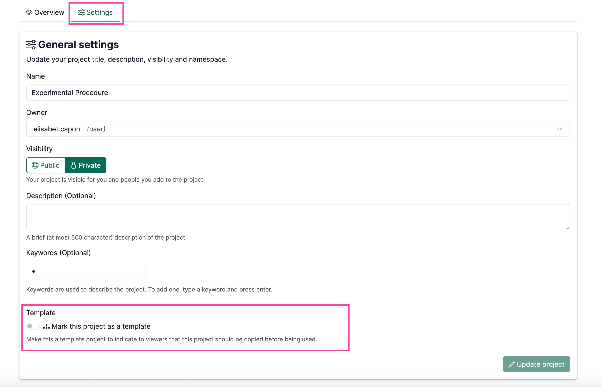
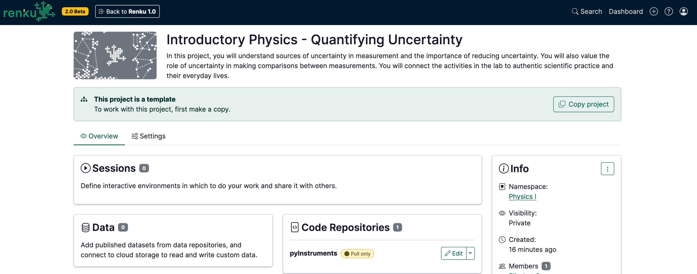

# How to set up a course in “Classic mode”

## Running a course in Classic Mode

If course participants need to save their work during the course and they are not comfortable using git, we suggest to create a **template** project in Renku. This enables students to copy the template project with the course materials, and then their own **data connector** where they can save their work.

This guide will walk you through how to create a project, mark that project as a template, and how to instruct your students to copy the template.

For alternative workflows for using Renku in your course, see [Renku for Teaching](https://www.notion.so/Renku-for-Teaching-1460df2efafc809cb134d2a4e32ed90e?pvs=21).

**First, create the course project:**

1. Create a Renku project as explained in [How to create a new project](/docs/users/projects/guides/create-a-project)
2. Add a code repository as explained in [How to add a code repository to your project](/docs/users/code/guides/add-code-repository-to-project) with the course tasks
3. Add data, if needed. See our collection of How To Guides for options for creating data connectors.
    
    :::info
    
    If you add data connectors to your template project, you must make the data connectors public in order for students to be able to create copies that include the data connector. For more information, see [Data Connectors Permissions](/docs/users/collaboration/permissions#data-connector-permissions.
    
    :::
    
4. Create a session launcher for working in your project:
    1. Select an environment:
        1. Check out the environments available in Renku via [How to add a session launcher to your project](/docs/users/sessions/guides/add-session-launcher-to-project). If these are sufficient for your course, use them!
        2. If you need to customize the environment for your course, you can create a custom environment yourself via [How to use your own docker image for a Renku session](/docs/users/sessions/guides/use-your-own-docker-image-for-renku-session), or  [Contact](/docs/users/community) us and we can create a custom environment for your course!
    2. Set the session launcher’s **default resource class** to your **course’s resource pool**, as described in [How to select compute resources for your session](/docs/users/sessions/guides/select-compute-resources-for-session).
        
        :::info
        
        In order to ensure adequate resources for running the project and to control the consumption of the sessions, remember to assign to the session launcher with the adequate resource class when adding the session launcher to your project. Learn more about custom resource pools for courses: [Request a Custom Resource Pool](/docs/users/sessions/resource-pools-and-classes#request-custom-resource-pool).
        
        :::
        

**Then, mark your project to a template project:**

1. In the project **Settings**, turn on the toggle to mark your project as a Template project.

By marking your project as a template project:

- When a student views the project for the first time, they will see a large banner inviting them to make a copy of the template project.
    
    
    
- When the student makes a copy of the template project, they will create a new project with the same code repositories, data connectors, and session launchers already in place.
- The student can add freely add more components to their copied project, such as their own data connector. This way, they can add a space to save their work. This has no effect on the template project.
- After the student makes a copy of the template project, if they visit the template project again, they are invited to redirect to their copy of the template.
    
    
    
- Owners of the template project can see projects that are copied from the template.
    
    
    
- Note about copies & access rights: that you are restricted to viewing copies of projects that you have access to. If someone makes a copy of your template and makes it private, you do not see that copy.

:::info

You can only view copies of projects that you have access to. If someone makes a copy of your template and makes it private, you do not see that copy.

:::

**Here’s what to instruct your students to do:**

1. Go to [insert template project link here](/)
2. Make a copy of the project using the banner in the button
   
    
    
3. (*If students work in teams*) Add your group members to their copy of the project under Settings ([How to add people to a project](/docs/users/collaboration/guides/add-people-to-project))
4. Add a new data connector to the project where you will save your work, such as a Switchdrive or PolyBox folder:
    - If working alone:  [How to connect a personal Switchdrive or Polybox folder to your project](/docs/users/data/guides/connect-data/connect-personal-switchdrive-or-polybox)
    - If working as a group: [How to connect a shared Switchdrive or PolyBox folder to your project](/docs/users/data/guides/connect-data/connect-shared-switchdrive-or-polybox-folder-to-project)

If you (the instructor) need to see your students’ projects, instruct them to either:

- Make the copy of the template project public
- Add the course instructor(s) as a member to their project (as a viewer)
