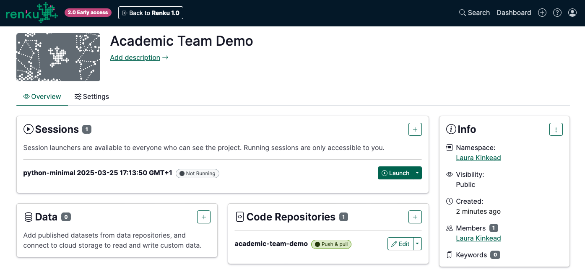
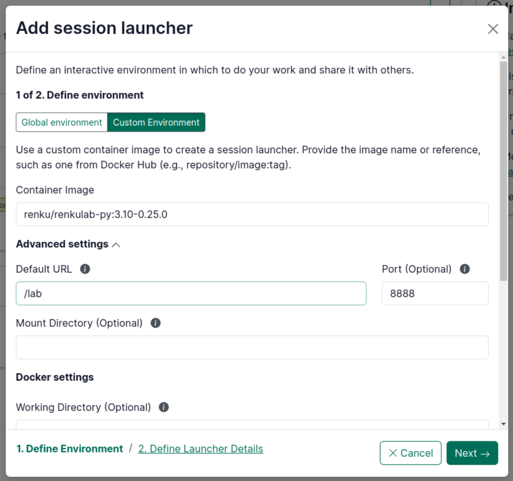

# Migrate a Renku Legacy project to Renku 2.0

This guide will explain what migrating a project from Renku Legacy to Renku 2.0 means, and walk you
through how to migrate your project.

## What happens when I migrate a project to Renku 2.0?

**✅ Code Repository**

The project code repository will be migrated automatically, and will show up in your Renku 2.0
project under the **Code repositories** section.

**✅ ✳️ Datasets & Git LFS Data**

Git LFS data, including Renku Datasets, are a part of your code repository, and will be available
from inside your Renku 2.0 session via the git lfs command line tool.

Git LFS data will not be downloaded automatically upon session launch, so you must run `git lfs
pull` inside your session.

:::warning

Please note that Renku 2.0 takes a significantly different approach to data compared to Renku
Legacy. Read more on our blog post: [Deep Dive: What's New in Renku
2.0](https://blog.renkulab.io/deep-dive-2-0/#data-connectors-replace-datasets). Consider moving your
data into an external storage system and connecting it to your project via a [Data
connector](/docs/users/data/data). 

:::

**❌ Cloud Storage Data**

Cloud storage migration isn’t available at the moment. Please reconfigure your cloud storage as a
Renku 2.0 [Data connector](/docs/users/data/data).

**✅ ✳️ Session**

By default, the Renku 2.0 project will be created with a [Session
Launcher](/docs/users/sessions/session-launcher) that uses **the latest image
created for the 1.0 project**.

:::info

If you would like to be able to continue to update what packages are installed in your environment,
you can [create an environment with custom
packages](/docs/users/sessions/guides/create-environment-with-custom-packages-installed) via
Renku 2.0's 'code based environments'.

:::

If you have a pinned image, the pinned image will be used.

The default resource class used by your Renku Legacy project session will be set as the default
resource class in the Renku 2.0 session launcher.

**✅ ✳️ Workflows**

You may continue to use Renku workflows in your session via the CLI.

:::warning

Please note that Renku 2.0 takes a significant different approach to workflows compared
to Renku Legacy. Read more on our blog post [Deep Dive: What's New in Renku
2.0](https://blog.renkulab.io/deep-dive-2-0/#a-new-vision-for-workflows).

:::

**✅ Metadata**

Project title, description, and keywords will be automatically migrated. You have the option to
modify the title of the project during the project migration process.

One exception is the project image, which is not migrated at this time.

**❌ Members**

Project members will not be migrated. Please add members directly to the Renku 2.0 project after
migrating.

:::tip
 If you would like to share a set of projects with a group, you can create a Renku 2.0
group! See [How to create a group](/docs/users/collaboration/guides/create-group).
:::

## Automated Migration

Here’s how to migrate your Renku Legacy project to 2.0:

1. Open a Renku Legacy project that you own. Only project owners can migrate projects.
2. In the banner at the top of the project page about project migration, click **Migrate**

    

    The migration banner invites you to migrate your project to Renku 2.0.

   3. Review that the project name, owner, and visibility as you want.

       

       
       

       The migration modal shows you what components of the project will and will not be migrated.

       :::tip

       If you would like to share your project with a group, we recommend creating that group in
       Renku 2.0 (see [How to create a group](/docs/users/collaboration/guides/create-group)). Then,
       come back to the project migration and select that group as the **owner** for the migrated
       project.

       :::

After you migrate the project, if you return to the 1.0 version of the project, you will see a
banner with a button to go to the 2.0 version of the project.

Banner inviting you to switch to the 2.0 version of the project.

The project now in Renku 2.0!

## Manual Migration

If for whatever reason you need to migrate a project manually, you can do so by creating a new Renku
2.0 project with all of the same code, data, and session components. Here’s how:

1. Create a new project in Renku 2.0
2. **Code:** Add your Renku Legacy project GitLab URL to the Code section in your Renku 2.0 project
    1. See [How to add a code repository to your project](/docs/users/code/guides/add-code-repository-to-project)
3. **Data**: If you use cloud storage in your project, create a data connector for the cloud storage object.
4. **Session:** Add your Renku Legacy project docker image:
    1. Navigate to your Renku Legacy project in **GitLab**
    2. Navigate in the left menu to **Deploy** and then **Container Registry**
    3. Click on the repository
    4. Find your latest tag, and click the 📋 icon to copy the URL. It should look like this:
        `registry.renkulab.io/laura.kinkead1/n2o-pathway-analysis:980f4a3`
    5. In your Renku 2.0 project, → Click on the ➕ in the Sessions box to create a new Session Launcher
        1. Select **Custom Environment**
        2. Paste the URL you copied from the GitLab container registry in the **Container Image** field
        3. In the **Advanced Settings**, specify the **Default URL**:
            1. If it’s a Jupyter-based image, enter `/lab`
            2. If it’s a RStudio-based image, enter `/rstudio`

        

        
        

    6. Click **Next**
    7. Give your Launcher a **name** that describes what it does
